# 🚀 Projeto Monitoramento de Servidor Nginx na AWS

Este projeto automatiza o monitoramento e notificação via webhook para servidores, utilizando NGINX e AWS. Foi proposto como primeiro projeto no programa de bolsas da UOL COMPASS trilha DevSecOps.

---

## 📦 Instalação

```bash
# Clone o repositório
git clone https://github.com/Ruan-Pablo-Oli/Nginx-with-monitoration.git
cd Nginx-with-monitoration
```

---

## 🛠️ Dependências

- NGINX
- AWS Account
- jq
- curl
- unzip

---

## ⚙️ Configuração AWS

#### 1. **Criação da VPC**
   
   **Primeiro passo: criar a VPC que será utilizada no projeto.**
   
   - Acesse o serviço VPC no console da AWS
   - No menu lateral, acesse a opção "Your VPCs"
   - Clique em "Create VPC" 
   - Configure as seguintes opções: 
      - VPC only
      - IPv4 CIDR manual input
      - No IPv6 CIDR block
      - Tenancy default
   - Adicione um name tag para identificação da VPC

   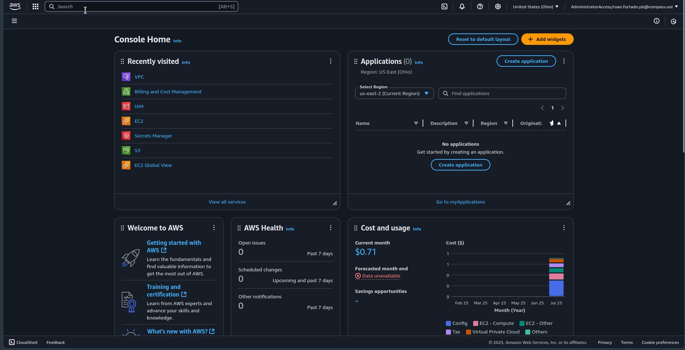


#### 2. **Criação das Subnets**
   
   **Segundo passo: criar as subnets para a VPC criada anteriormente.**

   - Acesse a opção "Subnets" no menu lateral do console AWS e clique em "Create subnet"
   - Selecione a VPC criada anteriormente
   - **Dica:** Primeiro escolha a região onde a VPC será criada, depois nomeie de acordo com essa região
   - **Dica:** Escolha zonas de disponibilidade diferentes para as subnets quando possível
   - Configure o IP da subnet (exemplo: 10.0.1.0/20)
   - Clique em "Create subnet"
   - Crie mais 3 subnets com IPs de rede diferentes (próxima subnet: 10.0.2.0/20)

   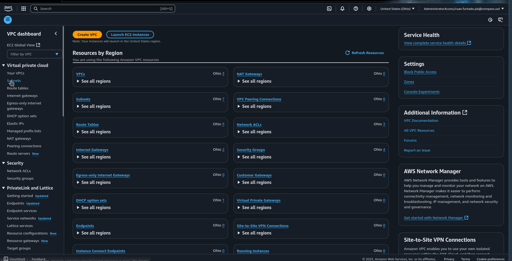


#### 3. **Criação do Internet Gateway**

   **Terceiro passo: criar o Internet Gateway para que as subnets públicas tenham acesso à internet.**

   - Acesse a opção "Internet Gateways" e clique em "Create Internet Gateway"
   - Adicione um name tag para identificação
   - Clique em "Create Internet Gateway"


#### 4. **Criação da Route Table**

   **Quarto passo: definir route tables para as subnets. Este processo será dividido em duas partes.**

   ##### 4.1 (Criando route table e associando com internet gateway)

   - Acesse a opção "Route Tables" no menu lateral
   - Clique em "Create route table"
   - Adicione um name tag e selecione a VPC criada no primeiro passo
   - Clique em "Create route table"
   - No campo "Routes", clique em "Edit routes"
   - Clique em "Add route"
   - Para o destino, escolha 0.0.0.0/0 (pacotes que acessarão a internet)
   - Escolha a opção "Internet Gateway" e selecione o gateway criado anteriormente
   - Salve as alterações

   ##### 4.2 (Associando subnets à route table)

   - Saia do campo "Routes" e acesse "Subnet associations"
   - Clique em "Edit subnet associations"
   - Escolha as duas subnets que serão públicas
   - Salve as associações
   - Para subnets privadas que precisam se comunicar entre si, crie uma tabela sem internet gateway e as associe

   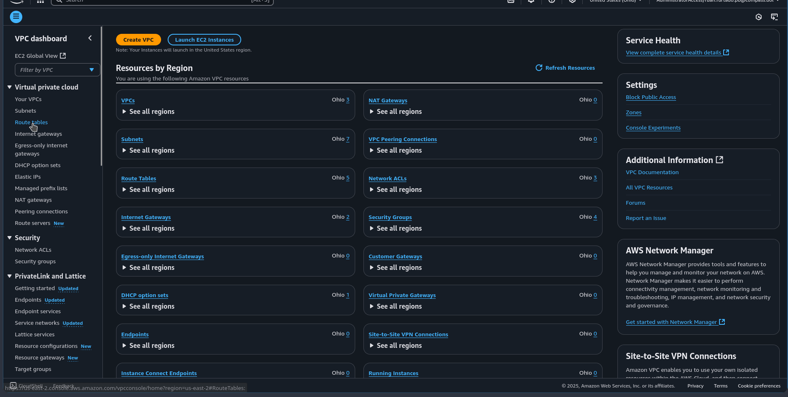

#### 5. **Criação do Security Group**

   **Quinto passo: criar o security group para permitir acesso SSH e HTTP ao serviço.**

   - Acesse a opção "Security Groups" na seção Security
   - Clique em "Create security group"
   - Adicione nome, descrição e escolha a VPC criada no primeiro passo
   - Crie duas regras Inbound: uma para SSH e outra para HTTP
   - Em "Source", configure "My IP" para restringir acesso apenas ao seu IP
   - Nas "Outbound rules", altere o destination da regra existente para "My IP"

   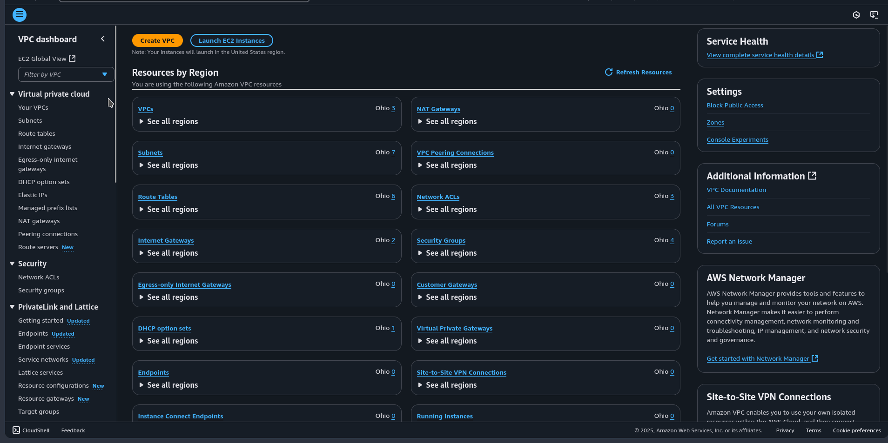


#### 6. **Bucket S3**
   **Criação do bucket com os arquivos que o user data utilizará para automatizar a configuração da instância.**

   ##### 6.1 (Criação do bucket)

   - Acesse o serviço S3 no console AWS
   - Clique em "Create bucket"
   - Configure as opções padrão, alterando apenas "Bucket Key" para "Disable"
   - Nomeie o bucket conforme necessário
   - Como será utilizado SSE-S3 para criptografia, não é necessário manter o Bucket Key habilitado

   ⚠️ **Importante:** Será necessário atualizar o nome do bucket no script user data conforme o nome escolhido.
   
   - No arquivo user data, altere os nomes dos buckets de acordo com o nome escolhido

   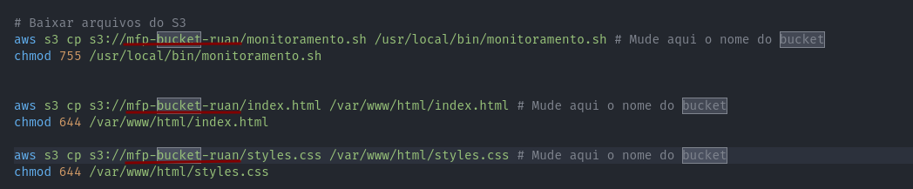

   ##### 6.2 (Upload dos arquivos)
   - Acesse o bucket criado para fazer upload dos arquivos
   - No campo "Objects", clique em "Upload"
   - Faça upload dos arquivos: monitoramento.sh, index.html e styles.css
   - Mantenha todas as opções padrão e clique em "Upload"

   **Nota:** É possível fazer upload usando AWS CLI, porém utilizaremos o método mais simples via console.

   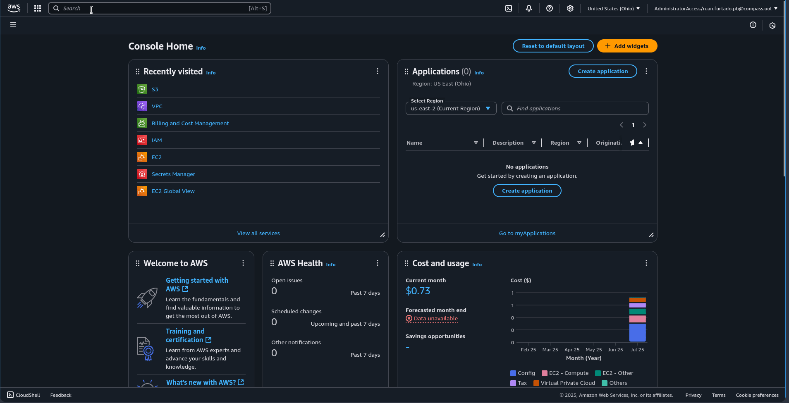

#### 7. **Secrets Manager**

   ##### Obtendo o webhook do Discord

   **Como obter o webhook do Discord:**
   
   1. **Acesse o servidor Discord** onde possui permissões de administrador
   2. **Vá para Configurações do Servidor** (clique com botão direito no nome do servidor)
   3. **Acesse "Integrações"** no menu lateral
   4. **Clique em "Webhooks"** e depois em "Criar Webhook"
   5. **Configure o webhook:**
      - Defina o nome do webhook (ex: "Monitor Nginx")
      - Selecione o canal onde as notificações aparecerão
      - Copie a **URL do Webhook**
   6. **Salve as configurações**

   ⚠️ **Importante:** Mantenha a URL do webhook segura - qualquer pessoa com acesso pode enviar mensagens para o servidor.

   **Configuração do AWS Secrets Manager:**

   - Acesse o serviço "Secrets Manager" no console AWS
   - Clique em "Store a new Secret"
   - Selecione a opção "Other type of secret"
   - **Importante:** Mantenha o nome e configuração do secret conforme especificado para o funcionamento do monitoramento.sh
   - A chave deve ser "webhook" e o valor deve ser o webhook obtido do Discord
   - Clique em "Next" e defina o secret name como exatamente "discord/webhook-api"
   - Clique em "Next", não configure rotation e finalize a criação do secret
   
   **Exemplo:**   

     ```json
     {
       "webhook":"https://discord.com/api/webhooks/xxx/yyy"
     }
     ```


   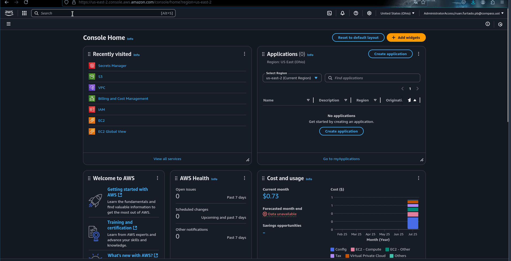


#### 8. **Permissões IAM**

   **Criação das roles para que a instância EC2 possa acessar os arquivos do bucket e o secret.**

   - Acesse o serviço IAM no console AWS
   - Clique em "Roles"
   - Será criada uma role com duas policies: uma para acesso ao S3 e outra para acesso ao Secrets Manager
   - Clique em "Create role"
   - Selecione "AWS service" e escolha "EC2" em use case
   - Adicione as policies: "AmazonS3FullAccess" e "SecretsManagerReadWrite"
   - **Nota:** O ideal é seguir a política de menor privilégio com policies mais específicas, mas para ambiente de desenvolvimento, essa solução é adequada
   - Clique em "Next", adicione um nome e finalize clicando em "Create role"
   
   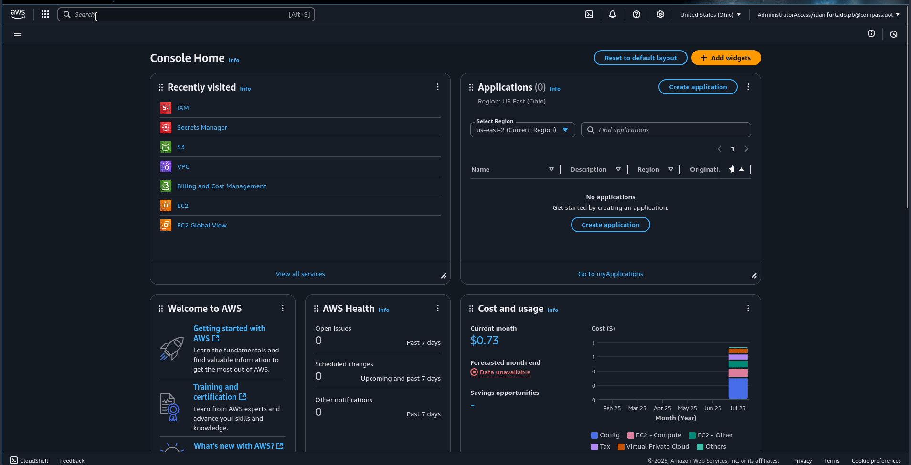

#### 9. **Criação da EC2 com Nginx usando User Data**

   **Passo final: criar uma instância EC2 utilizando user data para automatização.**
   
   - Acesse o serviço EC2 no console AWS
   - Entre na opção "Instances" e clique em "Launch instances"
   - Configure as tags necessárias
   - Selecione a AMI Ubuntu, instance type t2.micro
   - Use um key pair existente ou crie um novo para conexão SSH
   
   ##### 9.1 Configuração de rede
   **Utilizando a infraestrutura de rede criada anteriormente:**
   - Na seção "Network settings", clique em "Edit"
   - Escolha a VPC criada
   - Escolha uma das subnets públicas criadas
   - Mantenha "Auto-assign public IP" desabilitado (será usado Elastic IP)
   - Selecione "Select existing security group" e escolha o security group criado
   - Em "Configure storage", escolha o tamanho da instância
   - Abra "Advanced details" e em "IAM instance profile" selecione a role criada
   - Em "User data", utilize o arquivo user_data.sh do repositório ou copie o conteúdo
   - Clique em "Launch instance"
   
   ⚠️ **Importante:** Lembre-se de editar o nome do bucket no user data (obrigatório) e do webhook caso tenha sido criado com outro nome.
   
   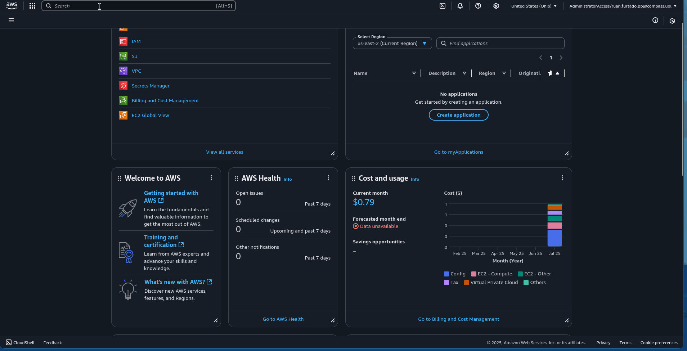

#### 10. **Associando Elastic IP à EC2**
   **Atribuindo um IP público à instância EC2.**

   - Acesse "Elastic IPs" na seção "Network & Security"
   - Clique em "Allocate Elastic IP address"
   - Clique em "Allocate"
   - Selecione o IP alocado e clique em "Actions"
   - Clique em "Associate Elastic IP address"
   - Em "Instance", escolha a instância inicializada
   - Clique em "Associate"

   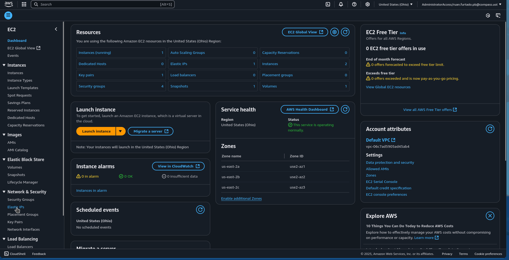

---

## ⚙️ Funcionamento do monitoramento.sh

Esta seção explica como o script de monitoramento funciona e quais comandos são utilizados para verificar o status do servidor Nginx.

### 📋 **Estrutura do Script**

O script `monitoramento.sh` é responsável por:
- Verificar se o servidor web Nginx está respondendo
- Registrar logs das verificações
- Enviar notificações via Discord quando há problemas

### 🔧 **Principais Comandos e Funcionalidades**

#### **1. Configuração Inicial**
```bash
#!/usr/bin/env bash
set -euo pipefail
export PATH=/usr/local/sbin:/usr/local/bin:/usr/sbin:/usr/bin:/sbin:/bin
```
- **`set -euo pipefail`**: Configura o script para sair imediatamente em caso de erro
- **`export PATH`**: Define o PATH para garantir acesso aos comandos necessários já que vai ser rodado no cron, é melhor garantir que todos os comandos sejam encontrados

#### **2. Variáveis de Ambiente**
```bash
ENV_FILE="/etc/environment"
LOGFILE="/var/log/monitoramento_logs.txt"
```
- **`ENV_FILE`**: Arquivo contendo variáveis de ambiente (WEBHOOK_URL, SITE_URL)
- **`LOGFILE`**: Arquivo onde são registrados todos os logs do monitoramento

#### **3. Sistema de Logs**
```bash
log() {
  local ts
  ts="$(date '+%Y-%m-%d %H:%M:%S')"
  echo "[$ts] $*"
}
```
- **Função `log()`**: Adiciona momento atual às mensagens de log
- **`date '+%Y-%m-%d %H:%M:%S'`**: ts recebe a execução desse comando, que retorna a data e hora atual
- **echo "[$ts] $*"**> Concatena ts com todos as argumentos passados e imprime

#### **4. Notificação Discord**
```bash
notify_discord() {
  local content="$1"
  curl -sS -H "Content-Type: application/json" \
       -d "$(printf '{"content":"%s"}' "$content")" \
       "$WEBHOOK_URL" || true
}
```
- **`curl -sS`**: Faz requisição HTTP silenciosa ao webhook do Discord
- **`Content-Type: application/json`**: Define o tipo de conteúdo como JSON
- **`|| true`**: Garante que o script continue mesmo se a notificação falhar

#### **5. Verificação de Arquivo de Ambiente**
```bash
[! -e "$ENV_FILE" ] && log "ERROR. Arquivo $ENV_FILE não encontrado!" && exit 1
[ ! -r "$ENV_FILE" ] && log "ERROR. Sem permissão de leitura em $ENV_FILE" && exit 1
source "$ENV_FILE"
```
- **`[! -e "$ENV_FILE" ]`**: Verifica se o arquivo existe
- **`[ ! -r "$ENV_FILE" ]`**: Verifica se há permissão de leitura
- **`source "$ENV_FILE"`**: Carrega as variáveis de ambiente

#### **6. Sistema de Lock (Prevenção de Execução Simultânea)**
```bash
exec 9>"/var/lock/monitoramento.lock" || exit 1
flock -n 9 || exit 0
```
- **`exec 9>`**: Abre um file descriptor para o arquivo de lock
- **`flock -n 9`**: Tenta obter um lock não-bloqueante
- **Faz com que múltiplas instâncias não rodem ao mesmo tempo**: Importante porque ao usar o cron, o script vai ser executado múltiplas vezes
#### **7. Verificação HTTP do Servidor**
```bash
HTTP_CODE=$(curl -o /dev/null -s -w "%{http_code}" --max-time 10 "$SITE_URL" || echo "000")
```
- **`curl -o /dev/null`**: Descarta o conteúdo da resposta pois o caminho /dev/null apaga qualquer coisa que for enviado
- **`-s`**: Modo silencioso (sem mostrar progresso)
- **`-w "%{http_code}"`**: Retorna apenas o código de status HTTP
- **`--max-time 10`**: Timeout de 10 segundos
- **`|| echo "000"`**: Retorna "000" em caso de erro de conexão

#### **8. Análise do Resultado e Notificação**
```bash
if [[ "$HTTP_CODE" != "200" ]]; then
  msg="O site está fora do ar! Código HTTP: $HTTP_CODE."
  log "$msg"
  notify_discord ":x: $msg"
else
  log "Site $SITE_URL OK (HTTP 200)."
fi
```
- **Verifica se o código HTTP é 200** (sucesso)
- **Se diferente de 200**: Registra erro e envia notificação ao Discord
- **Se igual a 200**: Registra que o site está funcionando

---

## 🚀 Funcionamento do user_data.sh

Esta seção explica como o script user data funciona para automatizar a configuração completa da instância EC2 durante sua inicialização.

### 📋 **Estrutura do Script**

O script `user_data.sh` é responsável por:
- Instalar e configurar o servidor web Nginx
- Baixar arquivos necessários do bucket S3
- Configurar variáveis de ambiente
- Configurar monitoramento automático via cron
- Garantir que todos os serviços iniciem automaticamente

### 🔧 **Principais Comandos e Funcionalidades**

#### **1. Configuração Inicial e Instalação de Pacotes**
```bash
#!/bin/bash
set -e
apt update -y
apt install -y nginx unzip curl jq
```
- **`set -e`**: Para a execução se algum comando falhar
- **`apt update -y`**: Atualiza a lista de pacotes disponíveis
- **`apt install -y`**: Instala Nginx, unzip, curl e jq automaticamente

#### **2. Instalação do AWS CLI v2**
```bash
cd /tmp
curl "https://awscli.amazonaws.com/awscli-exe-linux-x86_64.zip" -o "awscliv2.zip"
unzip -o awscliv2.zip
sudo ./aws/install
export PATH=$PATH:/usr/local/bin
```
- **`cd /tmp`**: Muda para diretório temporário
- **`curl`**: Baixa o AWS CLI v2 diretamente da AWS
- **`unzip -o`**: Extrai o arquivo sobrescrevendo se já existir
- **`sudo ./aws/install`**: Instala o AWS CLI no sistema
- **`export PATH`**: Adiciona o AWS CLI ao PATH para uso imediato

#### **3. Definição de Variáveis**
```bash
NOME_BUCKET="COLOQUE_AQUI_O_NOME_DO_BUCKET"
NOME_WEBHOOK="COLOQUE_AQUI_O_NOME_DO_WEBHOOK"
```
- **Variáveis customizáveis**: Devem ser editadas antes do deploy
- **`NOME_BUCKET`**: Nome do bucket S3 onde estão os arquivos
- **`NOME_WEBHOOK`**: Nome do secret no Secrets Manager

#### **4. Download e Configuração de Arquivos do S3**
```bash
aws s3 cp s3://$NOME_BUCKET/monitoramento.sh /usr/local/bin/monitoramento.sh
chmod 755 /usr/local/bin/monitoramento.sh

aws s3 cp s3://$NOME_BUCKET/index.html /var/www/html/index.html
chmod 644 /var/www/html/index.html

aws s3 cp s3://$NOME_BUCKET/styles.css /var/www/html/styles.css
chmod 644 /var/www/html/styles.css
```
- **`aws s3 cp`**: Copia arquivos do bucket S3 para a instância
- **`chmod 755`**: Torna o script executável (rwxr-xr-x)
- **`chmod 644`**: Define permissões de leitura para arquivos web (rw-r--r--)
- **Destinos**: Script vai para `/usr/local/bin/`, arquivos web para `/var/www/html/`

#### **5. Configuração de Variáveis de Ambiente**
```bash
WEBHOOK_URL=$(aws secretsmanager get-secret-value --secret-id $NOME_WEBHOOK --query 'SecretString' --output text | jq -r '.webhook')

touch /etc/environment
echo "WEBHOOK_URL=\"$WEBHOOK_URL\"" >> /etc/environment
echo 'SITE_URL="127.0.0.1"' >> /etc/environment
```
- **`aws secretsmanager get-secret-value`**: Recupera o webhook do Discord do Secrets Manager
- **`jq -r '.webhook'`**: Extrai apenas o valor do webhook do JSON
- **`touch /etc/environment`**: Cria o arquivo de variáveis de ambiente se não existir
- **`echo >> /etc/environment`**: Adiciona as variáveis ao arquivo

#### **6. Configuração de Auto-restart do Nginx**
```bash
mkdir -p /etc/systemd/system/nginx.service.d
cat >/etc/systemd/system/nginx.service.d/override.conf <<EOF
[Service]
Restart=always
RestartSec=5
EOF
```
- **`mkdir -p`**: Cria diretório para configurações customizadas do systemd
- **`cat > override.conf`**: Cria arquivo de configuração override
- **`Restart=always`**: Configura Nginx para reiniciar automaticamente em caso de falha
- **`RestartSec=5`**: Define 5 segundos de intervalo entre tentativas de restart

#### **7. Ativação e Inicialização dos Serviços**
```bash
systemctl daemon-reload
systemctl enable nginx
systemctl restart nginx
```
- **`systemctl daemon-reload`**: Recarrega configurações do systemd
- **`systemctl enable nginx`**: Configura Nginx para iniciar automaticamente no boot
- **`systemctl restart nginx`**: Reinicia o Nginx com as novas configurações

#### **8. Configuração do Cron para Monitoramento**
```bash
sudo bash -c '
(crontab -l 2>/dev/null | grep -v "/usr/local/bin/monitoramento.sh" | grep -v "/var/log/monitoramento_logs.txt"
echo "* * * * * /usr/local/bin/monitoramento.sh >> /var/log/monitoramento_logs.txt 2>&1"
echo "0 0 * * * > /var/log/monitoramento_logs.txt"
) | crontab -
'
```
- **`crontab -l`**: Lista o cron atual
- **`grep -v`**: Remove entradas existentes do monitoramento para evitar duplicatas
- **`* * * * *`**: Executa o script a cada minuto
- **`0 0 * * *`**: Limpa os logs à meia-noite todos os dias
- **`2>&1`**: Redireciona erros para o arquivo de log
- **`crontab -`**: Instala a nova configuração do cron

#### TESTES

   #### **Nginx**
   - A ec2 já inicia com nginx rodando e um service, é possível ver isso com o comando: 
   ```bash
      sudo systemctl status nginx
   ```
   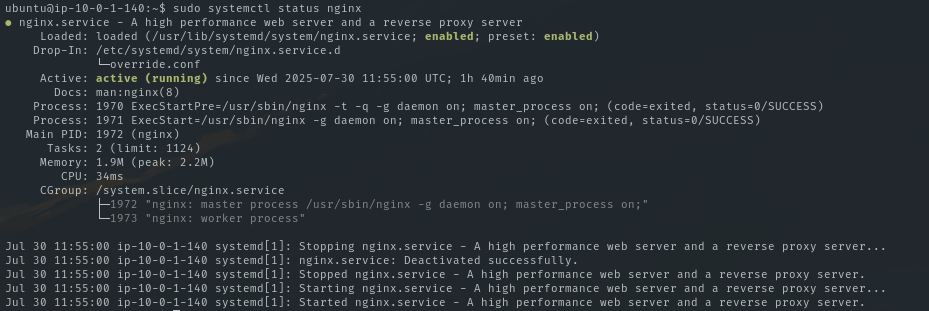

   #### **Crontab**
   - Após inicar a instância com userData, as tarefas foram agendadas no crontab. É possível ver isso com o comando:

      ```bash
         sudo crontab -l
      ```
   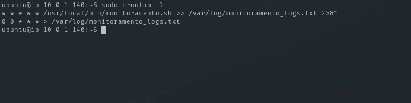

   ### **Monitoramento**

   - Como o script de monitoramento já foi agendado, os seus logs já estão sendo colocados em /var/log/monitoramento_logs.txt
   - É possível ver isso com o comando:
   ```bash
      sudo cat /var/log/monitoramento_logs.txt
   ```

   

   ### **Webhook Discord**
   - Para testar o webhook, pare o serviço do nginx com o comando abaixo e espera 1 minuto ou execute o script de monitoramento manualmente

   ```bash
      sudo systemctl stop nginx
      sudo /usr/local/bin/.monitoramento.sh
   ```
   - Tanto será notificado no discord como é possível ver a saída nos logs usando o comando: 
   ```bash
      sudo tail -n 10 /var/log/monitoramento_logs.txt
   ```
   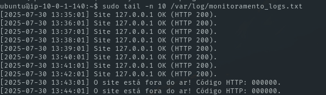
   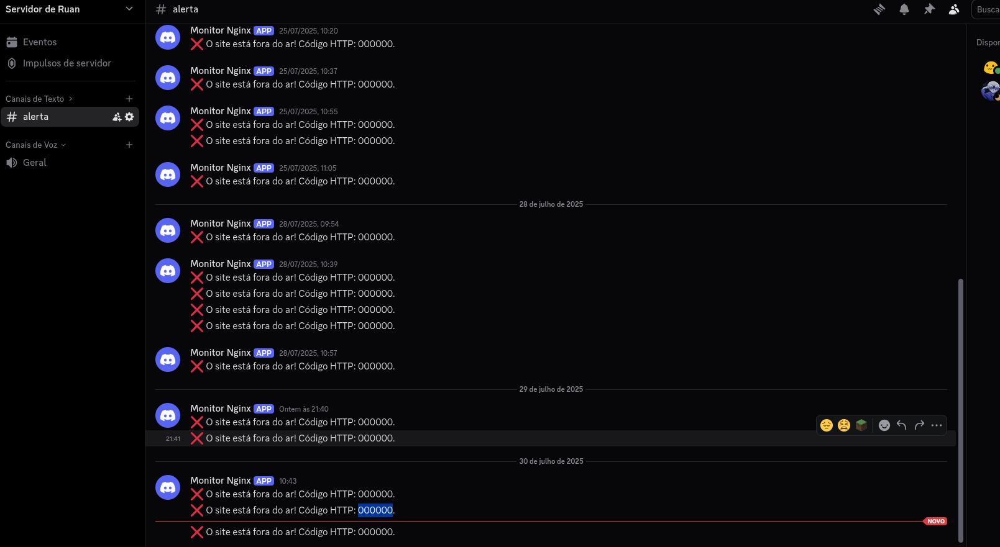


## 🕒 Agendamentos Cron

- `monitoramento.sh` roda a cada minuto.
- Logs são limpos diariamente à meia-noite.

---

## 💡 Como Usar

- Acesse o IP público da instância para visualizar o status do monitoramento
- Consulte os logs em `/var/log/monitoramento_logs.txt`
- As notificações serão enviadas automaticamente para o Discord configurado
- **LEMBRE-SE, NO SECURITY GROUP APENAS SEU IP FOI PERMITIDO PARA ACESSAR A INSTÂNCIA.**
- **APENAS SUA MÁQUINA PODERÁ ACESSAR O WEB SERVER**
---

